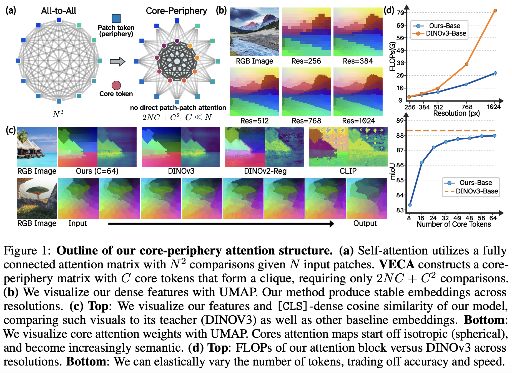
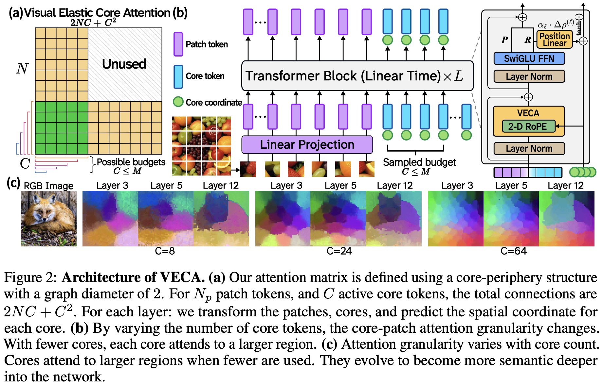

# Elastic Attention Cores for Scalable Vision Transformers

Official research code for **VECA** (**V**isual **E**lastic **C**ore
**A**ttention), a linear-time vision backbone that replaces dense
patch-to-patch self-attention with core-periphery attention.

VECA maintains dense, spatially aligned patch tokens throughout the network,
but routes global communication through a small set of learned **core tokens**.
For `N` image patches and `C` active cores, the attention connectivity is
`2NC + C^2` instead of the quadratic `N^2` patch-to-patch cost of standard
Vision Transformers. The same trained model can also run with different active
core budgets, enabling an elastic trade-off between compute and representation
quality at inference time.

## Figures

<p align="center">
  
</p>

<p align="center">
  
</p>

## Abstract

Vision Transformers (ViTs) achieve strong data-driven scaling by leveraging
all-to-all self-attention. However, this flexibility incurs a computational
cost that scales quadratically with image resolution, limiting ViTs in
high-resolution domains. VECA challenges the assumption that direct
patch-to-patch interactions are necessary for learning rich visual-semantic
representations. Instead, VECA uses efficient linear-time core-periphery
attention mediated by a small set of learned cores. Patches exchange information
exclusively through these core tokens, which are initialized from scratch and
propagated across layers. Because the `N` image patches directly interact only
with a resolution-invariant set of `C` learned cores, VECA scales linearly in
the number of patches for fixed `C`.

Unlike prior cross-attention architectures that compress the image into a small
latent bottleneck, VECA maintains and updates the full set of `N` patch tokens.
Combined with nested training along the core axis, a single VECA model can
elastically trade off compute and accuracy at inference time.

## Contributions

- **Core-periphery visual attention.** We propose VECA, a visual backbone that
  replaces quadratic patch self-attention with linear-time core-periphery
  attention in every layer, routing token communication through a
  resolution-invariant set of learned cores.
- **Competitive classification and dense representations.** We evaluate VECA on
  classification and dense spatial tasks, where it remains competitive with a
  DINOv3 teacher while substantially reducing attention interactions.
- **Elastic and interpretable cores.** We analyze the learned core tokens,
  showing emergent isotropic-to-semantic attention behavior, object-centric
  representations, and controllable compute through nested active-core budgets.

## Method Overview

Given patch tokens `Z = {z_1, ..., z_N}` and an ordered bank of learned core
tokens `R_M = {r_1, ..., r_M}`, VECA selects an active prefix
`R_C = R_M[:C]`. Each transformer block forms the sequence `[R_C; Z]`, but uses
a block-sparse attention pattern:

```text
cores   attend to: cores + patches
patches attend to: cores only
```

Equivalently:

```text
R' = Attn(R_C, [R_C; Z], [R_C; Z])
Z' = Attn(Z,   R_C,      R_C)
```

The cores form a fully connected communication interface, while patch tokens
retain a dense per-patch representation. VECA also assigns each core a learned
2D coordinate used by RoPE. Core coordinates evolve across layers through a
small coordinate prediction head, allowing cores to develop spatially and
semantically meaningful behavior.

## Repository Layout

```text
.
|-- README.md
|-- pyproject.toml
|-- scripts/
|   |-- pretrain_object365_ddp.py
|   `-- finetune_multires_object365_ddp.py
|-- veca/
|   |-- config.py
|   |-- data.py
|   |-- model.py
|   |-- teacher.py
|   |-- train_pretrain.py
|   |-- train_multires_finetune.py
|   `-- ...
`-- visualizations/
    |-- README.md
    |-- core_attention_layers_budgets.ipynb
    |-- attention_block_flops_benchmark.ipynb
    `-- multi_resolution_dense_features.ipynb
```

## Environment Setup

VECA training is intended for a CUDA Linux environment with Python 3.10 or
newer. A typical setup is:

```bash
conda create -n veca python=3.10 -y
conda activate veca
```

Install PyTorch and TorchVision for your CUDA version following the official
PyTorch instructions. Then install this repository in editable mode:

```bash
git clone https://github.com/alansong1322/VECA.git
cd VECA
pip install -e .
```

Core training dependencies are listed in `pyproject.toml` and include PyTorch,
TorchVision, timm, Transformers, NumPy, tqdm, Weights & Biases, and `dion`.
Distributed training uses `torchrun` with PyTorch DDP.

For the visualization notebooks, install the notebook-only extras manually:

```bash
pip install umap-learn matplotlib pandas
```

## Model Families

VECA model scale is controlled by `model_family` in `veca/config.py`.

| Family | Layers | Hidden Dim | Heads | Max Cores |
| --- | ---: | ---: | ---: | ---: |
| `small` | 12 | 384 | 6 | 64 |
| `splus` | 12 | 384 | 6 | 64 |
| `base` | 12 | 768 | 12 | 64 |
| `large` | 24 | 1024 | 16 | 64 |

The default active-core budget set is:

```text
8, 16, 24, 32, 40, 48, 56, 64
```

## Data Setup

The current training scripts are configured for Object365-style image folders.
Set either explicit train/validation directories:

```bash
export OBJECT365_TRAIN_DIR=/path/to/objects365/train
export OBJECT365_VAL_DIR=/path/to/objects365/val
export OBJECT365_INDEX_DIR=./indices
```

or set a shared root:

```bash
export OBJECT365_ROOT=/path/to/objects365
export OBJECT365_INDEX_DIR=./indices
```

The first main process builds image index files automatically when they are
missing. Index paths can also be overridden directly:

```bash
export OBJECT365_TRAIN_INDEX=/path/to/object365_train_paths.txt
export OBJECT365_VAL_INDEX=/path/to/object365_val_paths.txt
```

## Checkpoints

Pretrained VECA checkpoints are available through Google Drive:

```text
https://drive.google.com/drive/folders/1MpipJtZlhcYQqTUa4AnZ5kuepUIUcNA1?usp=sharing
```

Large checkpoint files are intentionally ignored by git.

Load a checkpoint in one line:

```python
from veca import load_model

model = load_model("/path/to/checkpoint.pt", device="cuda")
```

## Training

### 1. Pretrain With Nested Core Budgets

```bash
torchrun --standalone --nproc_per_node=6 scripts/pretrain_object365_ddp.py
```

This stage trains VECA with nested active-core budgets and DINOv3 distillation
at the configured image size.

Default checkpoint names are configured in `PretrainConfig`:

```text
veca_pretrain_dinov3vitb16_256_q64_nested.pt
veca_pretrain_dinov3vitb16_256_q64_nested_best.pt
```

### 2. Multi-Resolution Finetuning

```bash
torchrun --standalone --nproc_per_node=6 scripts/finetune_multires_object365_ddp.py
```

This stage loads the pretraining checkpoint when available and trains across
multiple resolutions and active-core budgets.

Default checkpoint names are configured in `MultiResFinetuneConfig`:

```text
veca_multires_finetune_dinov3vitb16_q64_nested.pt
veca_multires_finetune_dinov3vitb16_q64_nested_best.pt
```

Checkpoints are intentionally ignored by git. Download released weights from
the checkpoint link above, or store local experiment weights outside the source
tree.

## Configuration

Main defaults live in `veca/config.py`:

- `SharedConfig`: architecture, teacher, optimizer, and dataset defaults.
- `PretrainConfig`: single-resolution pretraining settings.
- `MultiResFinetuneConfig`: multi-resolution finetuning settings.

For small experiments, edit the config dataclasses directly. For more controlled
runs, create a small Python launch script that constructs a config and calls the
corresponding training entry point.

Example:

```python
from veca.config import MultiResFinetuneConfig
from veca.train_multires_finetune import main

cfg = MultiResFinetuneConfig()
cfg.model_family = "base"
cfg.total_steps = 50000
cfg.init_ckpt = "veca_pretrain_dinov3vitb16_256_q64_nested_best.pt"
cfg.ft_ckpt_name = "veca_multires_finetune_dinov3vitb16_q64_nested.pt"

main(cfg)
```

## Visualization

See [visualizations/README.md](visualizations/README.md) for notebook details.

The current notebooks are:

- [core_attention_layers_budgets.ipynb](visualizations/core_attention_layers_budgets.ipynb):
  visualizes core-to-patch attention behavior across layers and active-core
  budgets.
- [multi_resolution_dense_features.ipynb](visualizations/multi_resolution_dense_features.ipynb):
  compares dense features across resolutions and models with joint UMAP.
- [attention_block_flops_benchmark.ipynb](visualizations/attention_block_flops_benchmark.ipynb):
  compares attention-block FLOPs against corresponding DINOv3 models.

## Notes on Normalization

VECA and the DINO baselines use standard ImageNet channel normalization
constants:

```text
mean = (0.485, 0.456, 0.406)
std  = (0.229, 0.224, 0.225)
```

## Citation

Citation metadata will be added here.

```bibtex
@misc{veca2026,
  title  = {Elastic Attention Cores for Scalable Vision Transformers},
  author = {VECA Authors},
  year   = {2026},
  note   = {Placeholder citation}
}
```
